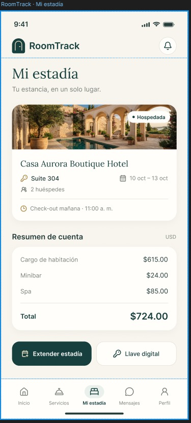
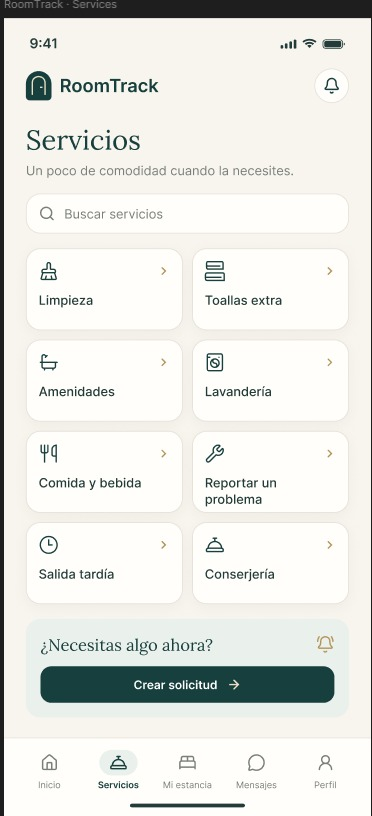

# RoomTrack · App móvil (Flutter)

App de operación hotelera para **todo el equipo del hotel y sus huéspedes**. Cada persona entra con su cuenta y
ve solo las funciones de su puesto: el administrador supervisa, recepción gestiona llegadas y pagos, limpieza
y mantenimiento siguen sus tareas, y el huésped gestiona su estadía desde el celular.

La app funciona de dos formas:

| Modo | Cuándo | Datos |
|---|---|---|
| **Demo** | Sin configuración | En memoria, con un hotel de ejemplo y un mes de historial. Se reinician al cerrar la app. |
| **Backend** | Con `--dart-define=API_BASE_URL=...` | Los del [backend de RoomTrack](https://github.com/RoomTrack/RoomTrack-BackEnd) (microservicios .NET + MySQL). |

---

## Contenido

- [Funcionalidades por rol](#funcionalidades-por-rol)
- [Diseño](#diseño)
- [Ejecutar](#ejecutar)
- [Conectar con el backend](#conectar-con-el-backend)
- [Arquitectura](#arquitectura)
- [Pruebas](#pruebas)
- [Estado de la integración con el backend](#estado-de-la-integración-con-el-backend)

---

## Funcionalidades por rol

La app implementa las historias de usuario **US-01 a US-34**. Las pestañas de la barra inferior cambian según el
rol, y lo demás que el rol puede hacer está en **Más**. Si alguien intenta abrir una función de otro rol, ve
"Acceso denegado" (US-01).

### Administrador
- **Panel** con ocupación, habitaciones por limpiar, incidencias abiertas y tareas atrasadas; lo crítico aparece
  primero y cada indicador lleva a su detalle (US-18).
- **Tablero de habitaciones** agrupado por estado y filtrable por piso, con historial de incidencias por
  habitación y alerta de problemas recurrentes (US-04, US-10).
- **Personal**: alta, cambio de rol y desactivación de cuentas (US-03).
- **Analítica**: productividad por colaborador, comparación entre áreas, tiempos de limpieza y de resolución,
  tendencia semanal, satisfacción por área y exportación a Excel (CSV) (US-24 a US-26).
- **Alertas automáticas** por demoras e incidencias críticas, con historial (US-23).
- **Reportes programados** por correo (US-34), **turnos** con detección de huecos de cobertura y cambios de turno
  (US-31).

### Recepción
- Llegadas del día, huéspedes hospedados y próximas reservas; **check-in y check-out asistidos** con sugerencia de
  habitaciones alternativas (US-27).
- **Disponibilidad** en tiempo real: solo habitaciones limpias, libres y sin incidencias abiertas (US-28).
- **Solicitudes** de huéspedes: registro y derivación al área correcta (US-11).
- **Asignación de limpieza** manual o automática por carga de trabajo (US-05).
- **Pagos y comprobantes**: cobro, pago dividido, factura con RUC y reenvío de comprobantes (US-16, US-17).

### Limpieza
- **Mis tareas** ordenadas por prioridad, con código de colores y filtro de urgencia alta (US-06, US-29).
- **Checklist por tipo de habitación**: la habitación no puede marcarse como limpia sin los ítems obligatorios
  (US-07).
- Reportar un desperfecto desde la misma tarea crea una incidencia para mantenimiento (US-06).

### Mantenimiento
- **Mis incidencias** por urgencia y fecha: en proceso, resuelta con observaciones, y escalamiento automático
  al administrador si una crítica se demora (US-08, US-09).
- **Mantenimiento preventivo** recurrente con recordatorios (US-30).

### Todo el personal
- **Mensajes** por área y comentarios en cada tarea, con historial (US-12).
- **Entrega de turno** con los pendientes del área y confirmación de lectura (US-32).
- **Notificaciones** con preferencias por tipo; las urgentes se destacan (US-22).
- **Perfil** y cambio de contraseña (US-02).

### Huésped
- **Inicio**: su habitación y el estado de sus solicitudes (US-19).
- **Servicios**: catálogo con buscador; los servicios con costo se cargan a la cuenta (US-33).
- **Mi estadía**: check-in digital, pago, llave digital, resumen de cuenta, extensión, check-out y evaluación de
  la estancia (US-13 a US-16, US-21).
- **Mensajes**: chat directo con recepción (US-20).

---

## Diseño

Las pantallas del huésped siguen los mockups de [`docs/mockups/`](docs/mockups):

| Mi estadía | Servicios |
|---|---|
|  |  |

- Paleta crema, verde oscuro y dorado; los colores están en `lib/shared/ui.dart` (`kPrimary`, `kGold`, `kSurface`...).
- Títulos con la tipografía serif **Lora** (licencia OFL, en `assets/fonts/`).
- El resto de roles usa la misma paleta y componentes.

---

## Ejecutar

Requisitos: Flutter 3.44 o superior (Dart 3.12) y un emulador o celular Android.

```bash
flutter pub get
flutter run
```

Sin más configuración la app arranca en **modo demo**. En el login hay botones con una cuenta por rol (contraseña
`demo123`):

| Rol | Correo |
|---|---|
| Administrador | `admin@roomtrack.com` |
| Recepción | `recepcion@roomtrack.com` |
| Limpieza | `limpieza@roomtrack.com` |
| Mantenimiento | `mantenimiento@roomtrack.com` |
| Huésped hospedada (como el mockup) | `huesped@roomtrack.com` |
| Huésped con reserva (para probar el check-in) | `huesped2@roomtrack.com` |

En modo demo los pagos con tarjeta están simulados: `4242 4242 4242 4242` se aprueba y `4000 0000 0000 0002` se
rechaza.

---

## Conectar con el backend

### 1. Levantar el backend en local

En el repositorio del backend (necesita Docker Desktop abierto):

```bash
docker compose up -d --build
curl http://localhost:8080/health   # Healthy
```

La primera vez, crea el administrador de cadena al levantar el servicio de identidad:

```bash
INITIAL_CHAIN_ADMIN_EMAIL=cadena@roomtrack.pe INITIAL_CHAIN_ADMIN_PASSWORD='Cadena-RoomTrack-2026!' \
  docker compose up -d identity-service
```

### 2. Cargar los datos de prueba

Desde este repositorio:

```bash
python tool/seed_backend.py
```

El script usa solo la API pública (a través del gateway) y crea el hotel **Casa Aurora Boutique Hotel**, 12
habitaciones, el personal y dos huéspedes con reserva. Se puede ejecutar varias veces: no duplica nada.
Los secretos MFA quedan en `tool/demo_accounts.local.json` (ignorado por git).

### 3. Ejecutar la app apuntando al backend

```bash
flutter run --dart-define=API_BASE_URL=http://10.0.2.2:8080/api/v1
```

En Android Studio: *Run → Edit Configurations → Additional run args*.

- `10.0.2.2` es la PC vista desde el emulador de Android. En un celular físico usa la IP de tu PC en la red.
- Las compilaciones de depuración permiten `http://` sin cifrar (`android/app/src/debug/AndroidManifest.xml`);
  la versión release exige HTTPS.

### Cuentas del backend local

| Rol | Correo | Contraseña |
|---|---|---|
| Administrador | `admin@roomtrack.pe` | `RoomTrack-Staff-2026!` |
| Recepción | `recepcion@roomtrack.pe` | `RoomTrack-Staff-2026!` |
| Limpieza | `limpieza@roomtrack.pe` | `RoomTrack-Staff-2026!` |
| Mantenimiento | `mantenimiento@roomtrack.pe` | `RoomTrack-Staff-2026!` |
| Huésped (reserva pagada) | `huesped@roomtrack.pe` | `RoomTrack-Huesped-2026!` |
| Huésped (pago pendiente) | `huesped2@roomtrack.pe` | `RoomTrack-Huesped-2026!` |

**Verificación en dos pasos.** El backend exige MFA (TOTP) a todo el personal:

- La primera vez que alguien del personal entra, la app muestra un **código QR** para Google Authenticator o
  Microsoft Authenticator y luego entrega los **códigos de recuperación**.
- El administrador ya la tiene activada por el script: agrega a tu app autenticadora el `mfaSecret` de
  `admin@roomtrack.pe` que está en `tool/demo_accounts.local.json`.
- Los huéspedes entran sin segundo factor.

**Correos.** En local el backend no envía correos: los escribe en el log del worker de notificaciones
(`docker compose logs notifications-worker`). Para verificar una cuenta o restablecer una contraseña, copia el
enlace del log y pégalo en la pantalla correspondiente de la app.

---

## Arquitectura

La estructura sigue la de la app SmartStay: núcleo, dominio, funcionalidades y componentes compartidos.

```
lib/
  main.dart                 Tema y arranque: restaura la sesión y abre el login o el panel del rol
  core/
    hotel_store.dart        Estado de la app y reglas de negocio (ChangeNotifier)
    seed.dart               Datos de demo y catálogo de servicios
    permissions.dart        Qué funcionalidad ve cada rol (Feature × UserRole)
    session.dart            Sesión guardada en flutter_secure_storage
    backend/
      api_client.dart       HTTP al gateway, renovación del token, errores traducidos al español
      remote_hotel.dart     Login con MFA, sincronización backend → store y acciones del backend
  domain/
    models.dart             Modelos: usuarios, habitaciones, tareas, incidencias, estancias, pagos...
  features/                 Una carpeta por área; cada pantalla escucha el store
    shell/                  Navegación por rol y registro de funcionalidades
    auth/  dashboard/  rooms/  housekeeping/  incidents/  requests/  front_desk/
    payments/  guest/  messages/  analytics/  staff/  shifts/  handover/
    alerts/  notifications/  profile/
  shared/
    ui.dart                 Paleta, componentes (AppCard, AppButton, PageHeader...) y ayudantes
    format.dart             Moneda y fechas en español
```

**Cómo fluyen los datos**

1. `HotelStore` es la única fuente de verdad de las pantallas. Cada pantalla se envuelve en `StoreBuilder`, así
   que cualquier cambio se refleja al instante en todas (tableros "en tiempo real").
2. En **modo demo**, `HotelStore` aplica las reglas de negocio directamente sobre sus listas.
3. En **modo backend**, `RemoteHotel` inicia sesión, copia en el store lo que el backend conoce (usuarios,
   habitaciones, reservas, pagos) y envía las acciones que el backend soporta. La sincronización se repite
   cada 20 segundos.
4. `permissions.dart` decide qué ve cada rol; `RoleGuard` bloquea el acceso directo a pantallas ajenas.

**Dependencias principales**: `http` (API), `flutter_secure_storage` (sesión), `qr_flutter` (QR del MFA) e
`image_picker` (foto del documento en el check-in).

---

## Pruebas

```bash
flutter analyze
flutter test
```

| Archivo | Qué prueba |
|---|---|
| `test/hotel_store_test.dart` | Reglas de negocio de las historias (checklist obligatoria, bloqueo por incidencias, escalamiento, pagos, check-out, turnos...) |
| `test/screens_smoke_test.dart` | Abre todas las pantallas de todos los roles y falla ante cualquier error de diseño |
| `test/widget_test.dart` | Login por rol y error genérico de credenciales |
| `test/backend/remote_hotel_test.dart` | Mapeo backend → app con un servidor simulado (sin red) |
| `test/backend/remote_hotel_live_test.dart` | Flujo real contra el backend local; se omite sin `API_BASE_URL` |

Para correr la prueba contra el backend (después de `tool/seed_backend.py`):

```bash
flutter test test/backend/remote_hotel_live_test.dart --dart-define=API_BASE_URL=http://localhost:8080/api/v1
```

---

## Estado de la integración con el backend

| Ya usa el backend | Todavía solo en la app (próximas fases del backend) |
|---|---|
| Login, MFA, verificación de correo, recuperación y cambio de contraseña | Tareas de limpieza y checklist |
| Habitaciones, cambio de estado e historial | Incidencias y mantenimiento preventivo |
| Alta, rol y desactivación del personal | Solicitudes y catálogo de servicios |
| Reservas y registro de pagos en recepción | Mensajes, notificaciones y alertas |
| Check-in digital con foto del documento y código de acceso | Turnos, entrega de turno y evaluaciones |
| Métricas del mes | Check-out, cargos adicionales y extensión de estadía |

Mientras tanto, lo que vive solo en la app se guarda en memoria del dispositivo. Cuando limpieza o mantenimiento
cambian el estado de una habitación, ese cambio sí se envía al backend.
